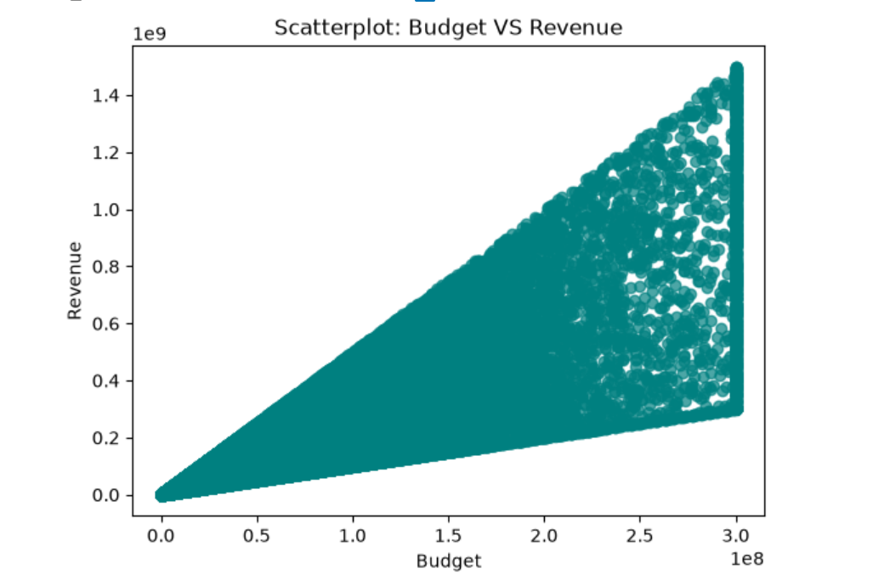
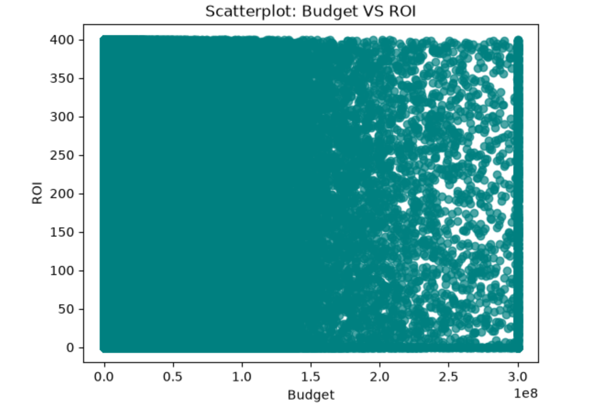
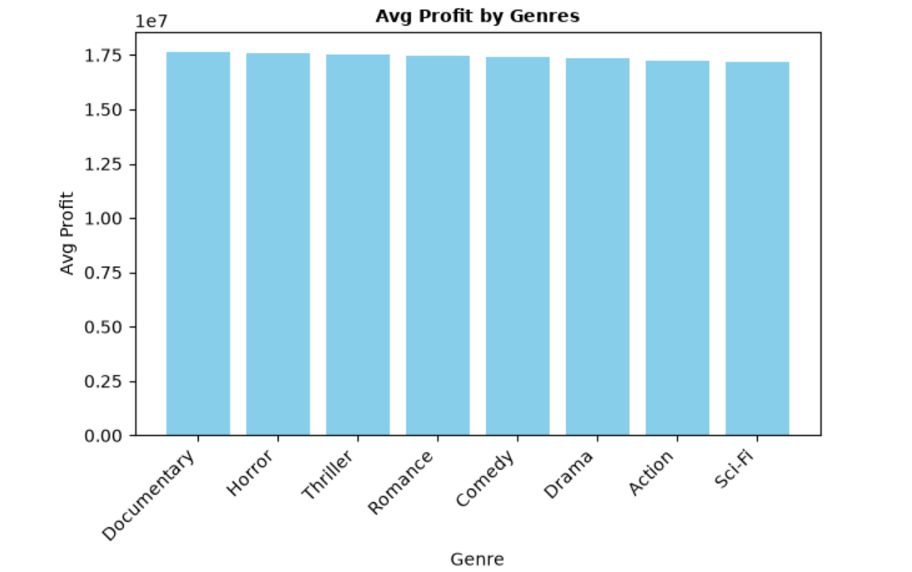
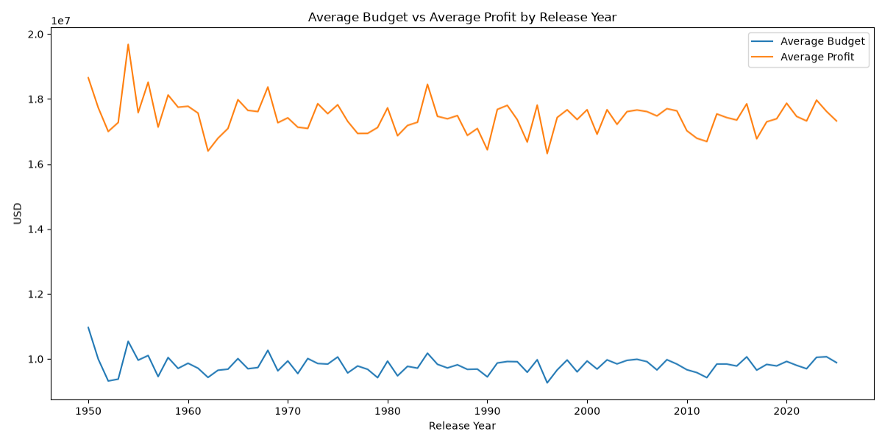

# Movie Data Analysis — Python

## Overview

This project analyzes a large movie dataset using Python to explore financial performance, profitability, ROI, genre performance, audience engagement, and changes in movie production over time.

## Business Questions

* How are movie budget, revenue, profit, and ROI distributed?
* Are there significant outliers in movie financial metrics?
* Does a higher production budget lead to higher revenue?
* Does a higher production budget lead to higher ROI?
* How many movies are profitable versus unprofitable?
* Which genres generate the highest profit?
* Which genres generate the highest ROI?
* Which genres have the strongest audience engagement?
* How have movie production and profitability changed over time?

## Dataset Overview

* **Rows:** 999,999 movies
* **Time period:** 1950–2025
* **Key financial metrics:** Budget, global box office revenue, profit, and ROI
* **Genre:** Movie genre classification
* **Audience metric:** IMDb votes
* **Rating metric:** IMDb rating

## Tools & Libraries

* Python
* Pandas
* NumPy
* Matplotlib
* Jupyter Notebook

## Analysis Performed

### Financial Distribution

Analyzed the distribution of:

* Production budget
* Global box office revenue
* Profit
* ROI

Used descriptive statistics and skewness to identify the shape of the distributions.

### Outlier Analysis

Applied the IQR method to identify statistical outliers in movie financial metrics.

### Budget & Financial Performance

Analyzed the relationship between production budget and:

* Global box office revenue
* ROI

This analysis evaluates whether higher production budgets are associated with stronger financial performance.

### Profitability Analysis

Classified movies as:

* Profitable
* Break-even
* Unprofitable

The analysis found that approximately **88.9% of movies were profitable**, while approximately **11.1% reached break-even** based on the calculated profit metric.

### Genre Analysis

Compared movie genres based on:

* Average profit
* Average ROI
* Average IMDb votes

Documentary movies had the highest average profit, while Horror achieved the highest average ROI and average IMDb votes. However, financial performance was relatively consistent across genres, suggesting that genre alone is not a strong differentiator of profitability in this dataset.

### Trend Analysis

Compared average movie production budgets and average profits across release years from 1950 to 2025.

## Key Findings

* Movie financial metrics are highly right-skewed, with a relatively small number of movies generating exceptionally high budgets, revenues, and profits.
* Higher production budgets are strongly associated with higher global box office revenue.
* Higher production budgets do not guarantee higher ROI.
* Approximately 88.9% of movies were profitable, while 11.1% reached break-even.
* Genre-level financial performance is relatively consistent, although Documentary showed the highest average profit and Horror showed the highest average ROI.
* Average production budgets and profits remained relatively stable across the period analyzed.

## Recommendations

* Production budget decisions should consider expected revenue potential rather than assuming that larger budgets automatically produce higher ROI.
* Financial performance should be evaluated using both absolute profit and ROI to distinguish scale from efficiency.
* Consider genre performance together with audience engagement when evaluating movie investment opportunities.

## Limitations

* IMDb votes measure audience interaction on IMDb and do not represent total movie audience engagement across all platforms.
* Financial metrics are highly right-skewed, so average values may be influenced by a relatively small number of very successful movies.
* The analysis is based on the available dataset and may not represent the entire movie industry.

## Selected Visualizations

### Budget vs Revenue



### Budget vs ROI



### Profitability by Genre



### Production Budget and Profit Over Time




## Project Structure

```text
movie-analysis-python/
│
├── README.md
├── Movie_Data_Analysis.ipynb
│
└── images/
    ├── budget_vs_revenue.png
    ├── budget_vs_roi.png
    ├── profitability.png
    ├── avg_profit_by_genre.png
    ├── avg_roi_by_genre.png
    ├── audience_engagement_by_genre.png
    └── budget_profit_over_time.png
```

## Notebook

The complete analysis, Python code, visualizations, findings, recommendations, and limitations are available in:

**[Movie Data Analysis Notebook](Movie_Data_Analysis.ipynb)**
